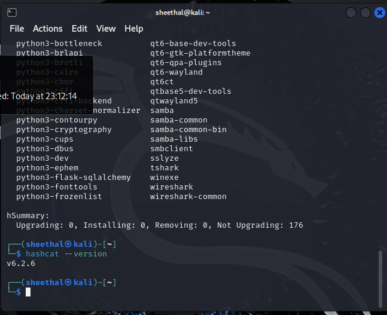
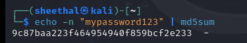
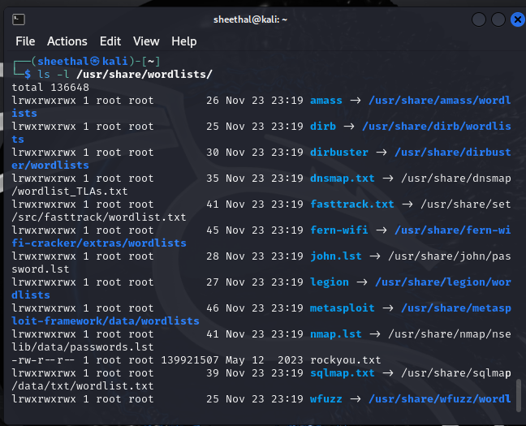
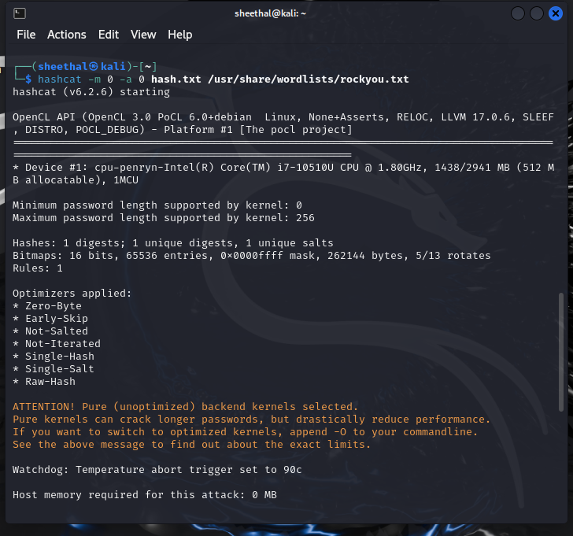
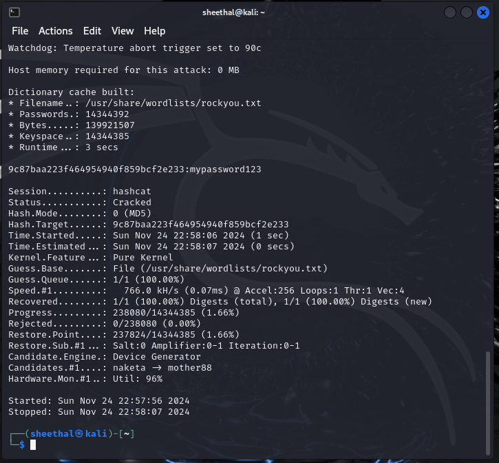
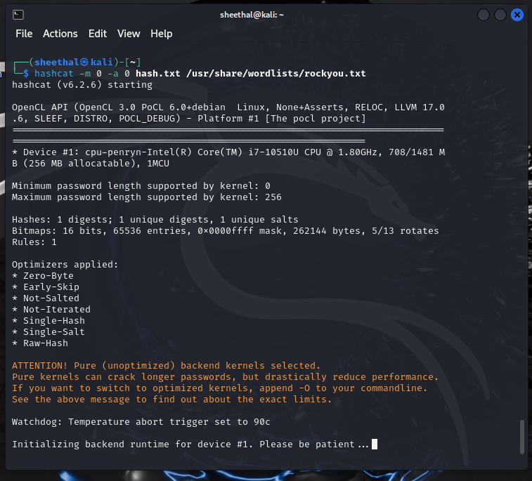

# Password Cracking with Hashcat

## About the Project
This project demonstrates the process of cracking a weak password hash using **Hashcat** and the `rockyou.txt` wordlist. It highlights vulnerabilities of weak passwords and emphasizes the importance of strong password practices. By cracking an MD5 hash, this project showcases foundational cybersecurity skills using a widely-used password recovery tool.

---

## Objectives
1. Learn how password hashes are stored and their vulnerabilities.
2. Use the `rockyou.txt` wordlist with Hashcat to recover an MD5 hash.
3. Gain hands-on experience with ethical password recovery.

---

## Workflow

### Step 1: Install and Verify Hashcat
We started by ensuring that Hashcat was installed and working correctly. To check the version of Hashcat:
```bash
hashcat --version
```

---

### Step 2: Generate a Sample Hash
To simulate cracking a password, we generated an MD5 hash for the password `mypassword123` using the following command:
```bash
echo -n "mypassword123" | md5sum
```
The resulting hash was:
```
9c87baa223f464954940f859bcf2e233
```

The hash was then saved into a file called `hash.txt`:
```bash
echo "9c87baa223f464954940f859bcf2e233" > hash.txt
```

---

### Step 3: Prepare the Wordlist
The wordlist `rockyou.txt` was extracted from its compressed format using the following command:
```bash
sudo gunzip /usr/share/wordlists/rockyou.txt.gz
```

---

### Step 4: Cracking the Hash with Hashcat
We used Hashcat to crack the hash stored in `hash.txt` with the help of the `rockyou.txt` wordlist. The command used was:
```bash
hashcat -m 0 -a 0 hash.txt /usr/share/wordlists/rockyou.txt
```

- **`-m 0`** specifies that the hash type is MD5.
- **`-a 0`** specifies a wordlist-based attack.

---

### Step 5: Saving and Reviewing the Results
Hashcat successfully cracked the password:
- **Hash**: `9c87baa223f464954940f859bcf2e233`
- **Recovered Password**: `mypassword123`

The cracked password was saved in a file called `cracked_password.txt`:
```bash
echo "mypassword123" > cracked_password.txt
```

---

## Results
1. Successfully cracked the hash: `9c87baa223f464954940f859bcf2e233`
2. Recovered password: `mypassword123`
3. Used the `rockyou.txt` wordlist for the attack.
4. Runtime: Less than 1 second.

---

## Skills Demonstrated
1. Generating MD5 hashes using Linux commands.
2. Using Hashcat for ethical password recovery.
3. Working with pre-installed wordlists in Kali Linux.
4. Understanding password vulnerabilities.

---

## Challenges and How They Were Solved
1. **Challenge**: Missing `rockyou.txt.gz` file.
   - **Solution**: Verified the file location and manually extracted it using `gunzip`.

2. **Challenge**: Limited virtual machine resources caused slow performance.
   - **Solution**: Allocated additional memory and CPU cores to the VM.

---

## Screenshots
### 1. **Hashcat Version Installed**
   

### 2. **Sample Password Hash**
   

### 3. **Wordlist Extracted**
   

### 4. **Hashcat Run Part 1**
   

### 5. **Hashcat Run Part 2**
   

### 6. **Cracked Password**
   

---

## Repository Structure
```plaintext
Password-Cracking-with-Hashcat/
├── README.md               # Documentation of the project
├── hash.txt                # The hashed password file
├── cracked_password.txt    # The cracked password file
├── Images/                 # Screenshots
    ├── Hashcat_version_installed.png
    ├── Sample_Password_hash.png
    ├── File_is_extracted.png
    ├── run_hashcat_part_1.png
    ├── run_hashcat_part_2.png
    ├── Cracking_my_hash.png
```

---

## Future Improvements
1. Experiment with other hash types (e.g., SHA-256, bcrypt).
2. Test advanced Hashcat features such as rule-based attacks.
3. Expand the wordlist to include custom passwords for cracking tests.
```
